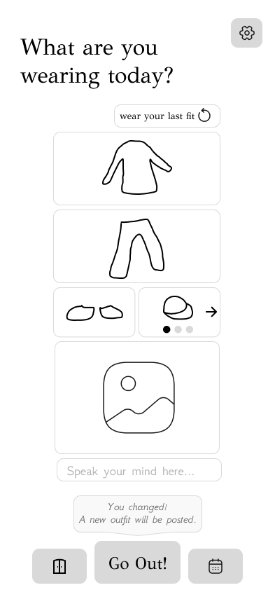
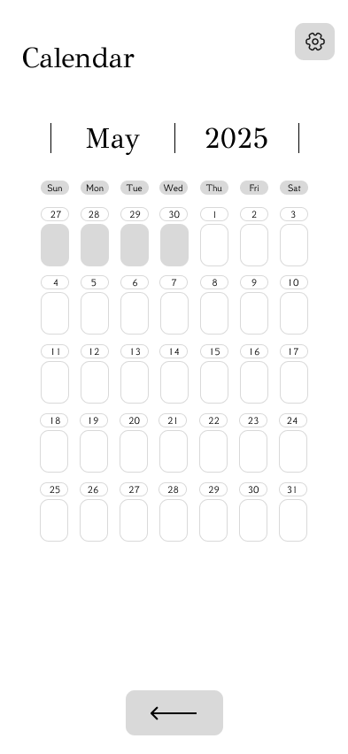
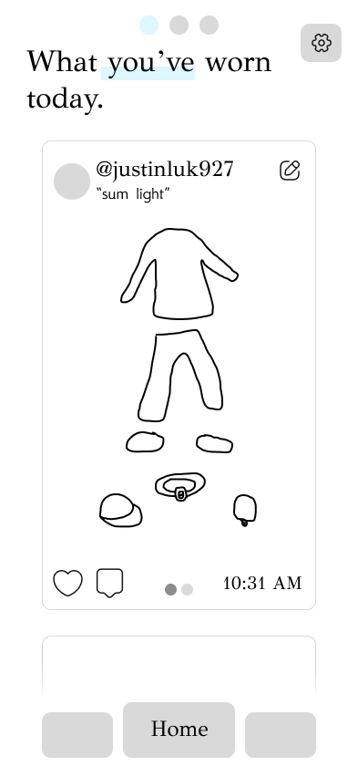
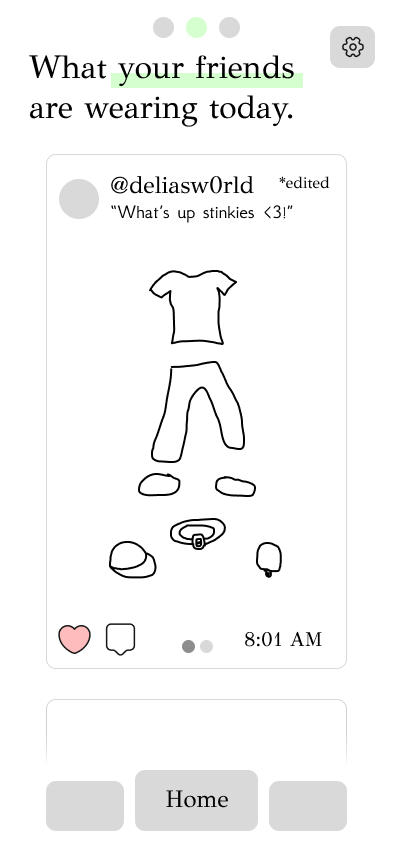

# Closet Database

## 🚧 Status: In Development
This project is currently under active development. Expect frequent changes and incomplete features.

---

## 📖 Overview

This mobile application was designed for two primary purposes, to help users keep track of their clothes and accessories and to allow users to share their outfits without stepping outside.

---

## 🧩 Planned Features

📸 Outfit sharing feed
🧥 Closet organization by tags, color, and season
🔍 Search and filter functionality
🛍️ Recommendations for new outfits based on existing items and liked items

---

## 🚀 Current Progress

[x] Design Front End in Figma
[ ] Develop Front End using Expo
[ ] Develop Backend

---

## 🛠️ Tech Stack

Languages: JavaScript
Frameworks/Libraries: Expo, React Native, TailwindCSS
Tools/Platforms: MySQL

---

## ⚙️ Setup

Coming soon! The app will be built with Expo.

---

## 📸 Screenshots / Demo

Figma Design: 

---

## 💬 Contact

Author: Justin Lukose
🌐 jjluk.net
✉️ [jjlukose55@gmail.com]
🧠 “Building efficient, connected, and secure systems.”

---